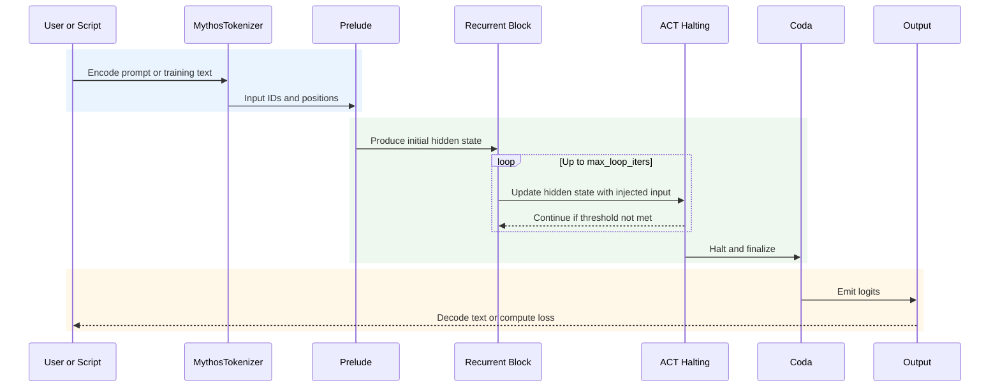

# OpenMythos

Research-first PyTorch implementation of a recurrent-depth transformer that combines looped inference, MLA or GQA attention, sparse MoE routing, and ACT-style halting.

> **Disclaimer:** OpenMythos is an independent, community-driven theoretical reconstruction based on publicly discussed ideas and papers. It is not affiliated with, endorsed by, or connected to Anthropic or any proprietary Claude system.

## Table of Contents

- [Overview](#overview)
- [System Architecture](#system-architecture)
- [Mathematical Formulation](#mathematical-formulation)
- [What Is New](#what-is-new)
- [Getting Started](#getting-started)
- [CLI Reference](#cli-reference)
- [Core Functionality](#core-functionality)
- [Configuration](#configuration)
- [Version History](#version-history)
- [License and Maintenance](#license-and-maintenance)
- [Citation](#citation)

## Overview

OpenMythos is a Python library for studying a recurrent-depth language model whose forward map is decomposed into three operators: a **Prelude** \(finite-depth feature extraction\), a shared **Recurrent Block** \(iterated latent refinement\), and a **Coda** \(post-recurrence readout\). Concretely, the repository exposes:

- ✅ A configurable `MythosConfig` dataclass in [open_mythos/main.py](open_mythos/main.py)
- ✅ Dual attention implementations: `MLAttention` and `GQAttention`
- ✅ Sparse MoE feed-forward routing with shared experts
- ✅ LTI-inspired recurrent input injection for loop stability
- ✅ ACT-style halting to decide when recurrent computation should stop
- 🚀 Training scripts for tiny single-GPU runs and larger FineWeb-Edu pretraining
- 💾 Script-driven examples, including an interactive terminal chat demo
- ⚠️ A research reconstruction, not an official implementation of Claude Mythos

### Project Map

```text
open_mythos/   core model, tokenizer, variants, and attention implementations
examples/      interactive chat demo, variants example, and MoDA smoke test
training/      tiny pretraining and 3B FineWeb-Edu training scripts
docs/          API reference and dataset guidance
```

## System Architecture

The runtime is organized around a tokenization stage, a loop-capable model core, and generation or training outputs. From the implementation point of view, the relevant state variables are the token indices, the embedded sequence \(x\), the frozen prelude encoding \(e\), the recurrent hidden state \(h_t\), and the emitted logits.



```mermaid
flowchart LR
    subgraph I["Input Pipeline"]
        direction TB
        U["User Text or Dataset<br/><i>prompt, corpus sample, or token batch</i>"]
        T["MythosTokenizer<br/><i>Hugging Face tokenizer wrapper</i>"]
    end

    subgraph M["OpenMythos Core"]
        direction TB
        P["Prelude Blocks<br/><i>standard transformer layers</i>"]
        R["Recurrent Block<br/><i>MLA or GQA + MoE + LoRA depth adaptation</i>"]
        H["ACT Halting<br/><i>continue or stop recurrent depth</i>"]
        C["Coda Blocks<br/><i>final refinement layers</i>"]
    end

    subgraph O["Outputs"]
        direction TB
        L["Logits<br/><i>next-token distribution</i>"]
        G["Generation or Loss<br/><i>decoded text or training objective</i>"]
    end

    U --> T --> P --> R --> H
    H -- continue --> R
    H -- halt --> C --> L --> G

    classDef input fill:#EAF4FF,stroke:#3670A0,stroke-width:1.5px,color:#0F172A;
    classDef core fill:#EEF8EE,stroke:#2F855A,stroke-width:1.5px,color:#0F172A;
    classDef output fill:#FFF7E8,stroke:#C05621,stroke-width:1.5px,color:#0F172A;
    class U,T input;
    class P,R,H,C core;
    class L,G output;
    linkStyle 0 stroke:#3670A0,stroke-width:2px;
    linkStyle 1 stroke:#3670A0,stroke-width:2px;
    linkStyle 2 stroke:#2F855A,stroke-width:2px;
    linkStyle 3 stroke:#2F855A,stroke-width:2px,stroke-dasharray: 4 2;
    linkStyle 4 stroke:#C05621,stroke-width:2px;
    linkStyle 5 stroke:#C05621,stroke-width:2px;
    linkStyle 6 stroke:#C05621,stroke-width:2px;
```

### Inference Sequence



## Mathematical Formulation

Let \(u = (u_1,\dots,u_T)\) be a token sequence, let \(E\) denote the token embedding map, and write

\[
x^{(0)} = E(u) \in \mathbb{R}^{T \times d}.
\]

The model is then the composition of three maps:

\[
u \mapsto x^{(0)} \xrightarrow{\;\mathcal P\;} e \xrightarrow{\;\mathcal R_T\;} h^\star \xrightarrow{\;\mathcal C\;} z,
\]

where:

- \(\mathcal P\) is the Prelude operator, implemented as `prelude_layers` standard transformer blocks,
- \(\mathcal R_T\) is the recurrent operator, obtained by iterating one shared block up to \(T = \texttt{max\_loop\_iters}\) times,
- \(\mathcal C\) is the Coda operator, implemented as `coda_layers` standard transformer blocks,
- \(z \in \mathbb{R}^{T \times |\mathcal V|}\) are the output logits.

### Prelude

If \(\mathcal P_1,\dots,\mathcal P_p\) denote the dense prelude blocks, then

\[
e = \mathcal P_p \circ \cdots \circ \mathcal P_1(x^{(0)}).
\]

In the code this is the tensor stored as the frozen input encoding \(e\), which is re-injected at every recurrent step rather than being discarded after the prelude.

### Recurrent Block

The recurrent block evolves a latent state \(h_t \in \mathbb{R}^{T \times d}\). The initialization is

\[
h_0 = e.
\]

At recurrent depth \(t\), the implementation computes

\[
\tilde h_t = h_t + \phi_{\mathrm{loop}}(t),
\]

where \(\phi_{\mathrm{loop}}\) is the loop-index embedding. After normalization and a shared transformer block, a depth-wise LoRA perturbation is added:

\[
r_t = F_\theta\!\big(\mathrm{RMSNorm}(\tilde h_t + e)\big) + \Delta_t^{\mathrm{LoRA}}.
\]

The state update is then

\[
h_{t+1} = A \odot h_t + B \odot e + r_t.
\]

This is exactly the update implemented by `LTIInjection.forward`, and it is the mathematically important novelty of the core recurrence: the model is not merely "the same block repeated," but a forced dynamical system driven by the persistent encoded input \(e\).

### Stable Injection

The matrix \(A\) is not learned as an unconstrained operator. Instead, the code parameterizes a diagonal contraction through

\[
A = \exp\!\big(-\exp(\log \Delta t + \log A_0)\big),
\]

with clamping in log-space for numerical stability. In particular, each coordinate of \(A\) lies in \((0,1)\), so the linear part of the recurrence is contractive coordinatewise. Informally: absent the nonlinear residual term \(r_t\), the latent dynamics do not explode.

### ACT Halting

At each recurrent step the model predicts a halting probability

\[
p_t = \sigma(W_{\mathrm{halt}} h_t) \in (0,1)^T.
\]

The final recurrent output is not simply \(h_T\), but an ACT-weighted sum

\[
h^\star = \sum_{t=1}^{T} \alpha_t \odot h_t,
\]

where the weights \(\alpha_t\) are determined by cumulative halting mass and a remainder correction so that each position contributes exactly until it halts. In other words, recurrent depth is adaptive at the token level.

### Attention and MoE

The shared block \(F_\theta\) can be instantiated in two geometrically different ways:

- `GQAttention`: standard grouped-query attention with \(n_{\mathrm{kv}} < n_{\mathrm{q}}\), hence smaller KV cache complexity,
- `MLAttention`: a compressed latent attention map in which the KV state is projected into a lower-dimensional latent space before reuse.

The feed-forward component in the recurrent block is a sparse MoE map

\[
\mathrm{MoE}(x) = \sum_{j \in \mathrm{TopK}(x)} \pi_j(x)\,E_j(x) \;+\; \sum_{s \in \mathcal S} S_s(x),
\]

where \(E_j\) are routed experts, \(\pi_j\) are routing weights, and \(S_s\) are always-on shared experts.

### Autoregressive Generation

For decoding, the repository implements a KV-cached autoregressive map. If \(u_{\le t}\) is the prefix, then the next-token law is

\[
\Pr(u_{t+1} = k \mid u_{\le t})
=
\mathrm{softmax}\!\left(\frac{z_t}{\tau}\right)_k,
\]

optionally truncated to the top-\(K\) logits before sampling. The recurrent depth parameter `n_loops` may be increased at inference time, so the repo explicitly supports depth extrapolation as an experimental knob.

### Where This Is Implemented

The mathematical objects above correspond directly to the following implementation sites:

- **RoPE precomputation and application**: [open_mythos/main.py](</d:/repos/OpenMythos/open_mythos/main.py:124>) and [open_mythos/main.py](</d:/repos/OpenMythos/open_mythos/main.py:146>)
- **Grouped Query Attention**: [open_mythos/main.py](</d:/repos/OpenMythos/open_mythos/main.py:177>)
- **Multi-Latent Attention**: [open_mythos/main.py](</d:/repos/OpenMythos/open_mythos/main.py:284>)
- **Sparse MoE feed-forward operator**: [open_mythos/main.py](</d:/repos/OpenMythos/open_mythos/main.py:456>)
- **Loop-index embedding \(\phi_{\mathrm{loop}}\)**: [open_mythos/main.py](</d:/repos/OpenMythos/open_mythos/main.py:541>)
- **Depth-wise LoRA perturbation \(\Delta_t^{\mathrm{LoRA}}\)**: [open_mythos/main.py](</d:/repos/OpenMythos/open_mythos/main.py:578>)
- **Stable injection \(h_{t+1} = A \odot h_t + B \odot e + r_t\)**: [open_mythos/main.py](</d:/repos/OpenMythos/open_mythos/main.py:684>)
- **ACT halting probability \(p_t\)**: [open_mythos/main.py](</d:/repos/OpenMythos/open_mythos/main.py:750>)
- **Full recurrent loop and ACT-weighted sum**: [open_mythos/main.py](</d:/repos/OpenMythos/open_mythos/main.py:788>)
- **Prelude \(\rightarrow\) Recurrent \(\rightarrow\) Coda composition**: [open_mythos/main.py](</d:/repos/OpenMythos/open_mythos/main.py:899>)
- **Autoregressive decoding law**: [open_mythos/main.py](</d:/repos/OpenMythos/open_mythos/main.py:1035>)

### How It Is Realized In Torch

The mathematics is not merely described in comments; it is realized as explicit PyTorch objects:

- \(u\) is the integer tensor `input_ids: torch.Tensor` passed into `OpenMythos.forward` at [open_mythos/main.py](</d:/repos/OpenMythos/open_mythos/main.py:991>)
- \(x^{(0)} = E(u)\) is computed by `self.embed(input_ids)` where `self.embed` is an `nn.Embedding` at [open_mythos/main.py](</d:/repos/OpenMythos/open_mythos/main.py:933>) and [open_mythos/main.py](</d:/repos/OpenMythos/open_mythos/main.py:1018>)
- the Prelude operator \(\mathcal P\) is an `nn.ModuleList` of transformer blocks at [open_mythos/main.py](</d:/repos/OpenMythos/open_mythos/main.py:945>) and is executed in the loop at [open_mythos/main.py](</d:/repos/OpenMythos/open_mythos/main.py:1024>)
- the frozen prelude encoding \(e\) is the tensor assignment `e = x` at [open_mythos/main.py](</d:/repos/OpenMythos/open_mythos/main.py:1027>)
- the recurrent state \(h_t\) is the tensor `h` inside `RecurrentBlock.forward` at [open_mythos/main.py](</d:/repos/OpenMythos/open_mythos/main.py:824>)
- the contraction coefficients \(A\) and input-injection coefficients \(B\) are `nn.Parameter` objects `log_A`, `log_dt`, and `B` in `LTIInjection` at [open_mythos/main.py](</d:/repos/OpenMythos/open_mythos/main.py:709>)
- the loop-index perturbation is a tensor built by `torch.arange`, `sin`, `cos`, and broadcasting in `loop_index_embedding` at [open_mythos/main.py](</d:/repos/OpenMythos/open_mythos/main.py:561>)
- the shared recurrent map \(F_\theta\) is the `TransformerBlock` stored as `self.block` inside `RecurrentBlock` at [open_mythos/main.py](</d:/repos/OpenMythos/open_mythos/main.py:815>)
- the LoRA correction \(\Delta_t^{\mathrm{LoRA}}\) is computed by `self.lora(trans_out, t)` using `nn.Linear`, `nn.Embedding`, and matrix multiplication at [open_mythos/main.py](</d:/repos/OpenMythos/open_mythos/main.py:598>) and [open_mythos/main.py](</d:/repos/OpenMythos/open_mythos/main.py:861>)
- the ACT probability \(p_t\) is the tensor `torch.sigmoid(self.halt(h)).squeeze(-1)` at [open_mythos/main.py](</d:/repos/OpenMythos/open_mythos/main.py:779>)
- the ACT-weighted latent sum \(h^\star\) is accumulated in the tensor `h_out` using `torch.where`, masking, and broadcasted multiplication at [open_mythos/main.py](</d:/repos/OpenMythos/open_mythos/main.py:852>) and [open_mythos/main.py](</d:/repos/OpenMythos/open_mythos/main.py:873>)
- the final logits \(z\) are the tensor returned by `self.head(self.norm(x))` at [open_mythos/main.py](</d:/repos/OpenMythos/open_mythos/main.py:1033>)
- the decoding measure \(\mathrm{softmax}(z_t/\tau)\) is realized by `F.softmax`, top-\(K\) truncation, and `torch.multinomial` at [open_mythos/main.py](</d:/repos/OpenMythos/open_mythos/main.py:1077>)

## What Is New

Relative to the older state of the repository, the most recent additions are:

- **Interactive chat example**: `examples/chat_example.py` now provides a terminal chat path, a checkpoint-loading path, and a stronger Hugging Face fallback model for immediate experimentation.
- **Variant-aware smoke testing**: the example now accepts named OpenMythos variants such as `mythos_1b`, `mythos_10b`, and `mythos_100b`, with an explicit hardware guard instead of a late OOM failure.
- **Code-oriented response handling**: for code requests, the example allocates a larger generation budget and returns the first complete fenced code block, which materially reduces truncated answers.
- **New examples directory**: the repo now contains `chat_example.py`, `variants_example.py`, and `moda_example.py`, so the project is easier to evaluate from the command line.
- **Flash Attention support**: the attention implementation now has explicit Flash Attention integration when the optional dependency is installed.
- **Recent correctness fixes in the core model**: the latest history includes fixes to ACT halting accumulation, MoE router bias behavior, KV-cache consistency across recurrent loops, LoRA depth extrapolation, and RoPE position handling during decoding.
- **Training pipeline cleanup**: the training scripts now include clearer logging and repository-local requirements for reproducing small and larger-scale runs.

In more mathematical language, the repository is no longer just "an implementation of a looped transformer." It has become a more explicit experimental platform for:

- constrained recurrent dynamics,
- adaptive latent-time computation,
- sparse expert routing inside a shared recurrent operator,
- and inference-time depth variation under KV-cached decoding.

## Getting Started

### Installation

Install from PyPI:

```bash
pip install open-mythos
```

Install with Flash Attention 2 support:

```bash
pip install open-mythos[flash]
```

Install local training extras for this repository:

```bash
pip install -r training/requirements.txt
```

### Quick Start

Create a small research-scale model and run a forward pass:

```python
import torch
from open_mythos import MythosConfig, OpenMythos

cfg = MythosConfig(
    vocab_size=32000,
    dim=256,
    n_heads=8,
    n_kv_heads=2,
    max_seq_len=128,
    max_loop_iters=4,
    prelude_layers=1,
    coda_layers=1,
    attn_type="gqa",
    n_experts=8,
    n_shared_experts=1,
    n_experts_per_tok=2,
    expert_dim=64,
    lora_rank=8,
)

model = OpenMythos(cfg)
input_ids = torch.randint(0, cfg.vocab_size, (2, 16))
logits = model(input_ids, n_loops=4)
print(logits.shape)
```

Start the interactive example chat:

```bash
python examples/chat_example.py
```

Use a trained OpenMythos checkpoint instead of the default fallback model:

```bash
python examples/chat_example.py --checkpoint checkpoints/step_0005000.pt
```

> **Note:** The tokenizer and default fallback chat model are downloaded from Hugging Face. Setting `HF_TOKEN` is optional but improves rate limits.

## CLI Reference

OpenMythos does not currently ship a packaged CLI binary. The repo is operated through Python scripts.

| Script                                   | Purpose                                                                                                   | Example                                                                    |
| ---------------------------------------- | --------------------------------------------------------------------------------------------------------- | -------------------------------------------------------------------------- |
| `examples/chat_example.py`               | Interactive terminal chat using either a trained OpenMythos checkpoint or a stronger fallback instruct model | `python examples/chat_example.py --checkpoint checkpoints/step_0005000.pt` |
| `examples/chat_example.py --random-init` | Smoke-test the OpenMythos generation path with an untrained OpenMythos variant                            | `python examples/chat_example.py --random-init --variant mythos_1b`        |
| `examples/variants_example.py`           | Instantiate a predefined model variant and print its parameter count                                      | `python examples/variants_example.py`                                      |
| `examples/moda_example.py`               | Run the alternative MoDA smoke test and verify gradients                                                  | `python examples/moda_example.py`                                          |
| `training/tiny_pretrain.py`              | Train a small checkpoint that can be loaded by the chat example                                           | `python training/tiny_pretrain.py`                                         |
| `training/3b_fine_web_edu.py`            | Run the larger FineWeb-Edu training pipeline                                                              | `torchrun --nproc_per_node=NUM_GPUS training/3b_fine_web_edu.py`           |

## Core Functionality

### Execution Modes

| Mode                   | Trigger                                             | Backing model                         | Best use                                         |
| ---------------------- | --------------------------------------------------- | ------------------------------------- | ------------------------------------------------ |
| OpenMythos checkpoint  | `--checkpoint path/to/step_*.pt`                    | Trained OpenMythos weights            | Real model experiments and checkpoint evaluation |
| HF fallback chat       | Run `examples/chat_example.py` without a checkpoint | `Qwen/Qwen2.5-1.5B-Instruct` | Out-of-the-box interactive demo                  |
| Random-init smoke test | `--random-init`                                     | Random-initialized OpenMythos variant | Wiring validation only; gibberish is expected    |

### Attention Backends

| Backend | Class         | Strength                                                 | Important config                                                                    |
| ------- | ------------- | -------------------------------------------------------- | ----------------------------------------------------------------------------------- |
| `gqa`   | `GQAttention` | Simpler grouped-query attention with smaller KV cache    | `n_heads`, `n_kv_heads`                                                             |
| `mla`   | `MLAttention` | Compressed KV cache for larger-context research variants | `kv_lora_rank`, `q_lora_rank`, `qk_rope_head_dim`, `qk_nope_head_dim`, `v_head_dim` |

### Recurrent Depth, Halting, and Stability

- ✅ **Prelude + Recurrent Block + Coda:** fixed prelude and coda layers frame a shared recurrent core that is looped up to `max_loop_iters`.
- ✅ **ACT halting:** `ACTHalting` can stop recurrent computation early once the halting threshold is reached.
- ✅ **LTI-style injection:** the recurrent block injects the original encoded input each loop to reduce drift and stabilize deeper recurrence.
- ✅ **LoRA depth adaptation:** lightweight rank-limited adapters allow loop-specific behavior without duplicating entire blocks.

### MoE Routing

- 🚀 `MoEFFN` uses routed experts plus always-on shared experts inside the recurrent block.
- 🚀 `n_experts_per_tok` controls top-k expert activation per token.
- ⚠️ Increasing experts widens model breadth, but it also raises memory pressure and routing complexity.

### Model Variants

Predefined variants are available in [open_mythos/variants.py](open_mythos/variants.py).

| Variant         | Hidden dim | Routed experts | Loop iters | Context   | Max output |
| --------------- | ---------- | -------------- | ---------- | --------- | ---------- |
| `mythos_1b()`   | 2048       | 64             | 16         | 4096      | 4096       |
| `mythos_3b()`   | 3072       | 64             | 16         | 4096      | 4096       |
| `mythos_10b()`  | 4096       | 128            | 24         | 8192      | 4096       |
| `mythos_50b()`  | 6144       | 256            | 32         | 8192      | 4096       |
| `mythos_100b()` | 8192       | 256            | 32         | 1,000,000 | 131,072    |
| `mythos_500b()` | 12288      | 512            | 48         | 1,000,000 | 131,072    |
| `mythos_1t()`   | 16384      | 512            | 64         | 1,000,000 | 131,072    |

### Training Workflow

| Workflow                 | Script                        | Notes                                                                           |
| ------------------------ | ----------------------------- | ------------------------------------------------------------------------------- |
| Tiny pretraining         | `training/tiny_pretrain.py`   | Single-GPU sized run that produces `step_*.pt` checkpoints for the chat example |
| Larger-scale pretraining | `training/3b_fine_web_edu.py` | FineWeb-Edu training pipeline with DDP support                                  |
| Dataset guidance         | `docs/datasets.md`            | Notes on training corpora and token budgets                                     |

## Configuration

OpenMythos is code-configured through `MythosConfig`; there is no YAML or JSON runtime config file in this repository. The defaults below are defined in [open_mythos/main.py](open_mythos/main.py).

### How to Read `MythosConfig`

`MythosConfig` controls four things:

- model width and context size
- which attention backend is used
- how large and sparse the MoE block is
- how much recurrent computation the model can do

As a rule:

- bigger `dim`, more heads, or more experts usually means more capacity and more memory use
- bigger `max_seq_len` or `max_output_tokens` increases sequence handling limits, but also increases memory pressure
- `attn_type="gqa"` and `attn_type="mla"` use different subsets of fields
- `dropout` mainly affects training; it is typically disabled for inference

### Core Model Fields

| Field | Default | What it controls | Practical effect |
|---|---|---|---|
| `vocab_size` | `32000` | Size of the token embedding table and output logits | Increase it only if your tokenizer needs more token IDs |
| `dim` | `2048` | Width of the residual stream across the whole model | Larger `dim` increases model capacity, activation size, and parameter count everywhere |
| `n_heads` | `16` | Number of query heads in attention | More heads can improve representation diversity, but `dim` must still split cleanly across heads |
| `n_kv_heads` | `4` | Number of key/value heads for GQA | Lower than `n_heads` reduces KV-cache memory; only meaningful for `attn_type="gqa"` |
| `max_seq_len` | `4096` | Maximum supported sequence length | Larger values allow longer prompts and training sequences, but require larger RoPE tables and more memory |
| `max_loop_iters` | `16` | Upper bound on recurrent loop depth | Higher values let the recurrent block think for more steps, but increase compute |
| `prelude_layers` | `2` | Dense transformer layers before recurrence starts | More prelude layers give stronger upfront feature extraction before looping |
| `coda_layers` | `2` | Dense transformer layers after recurrence ends | More coda layers give stronger post-loop refinement before logits |
| `max_output_tokens` | `4096` | Intended generation ceiling for the model config | Useful as a model-side limit for long generations; separate from prompt length |
| `dropout` | `0.0` | Dropout used in attention and residual paths | Usually `0.0` for inference and a nonzero value for training regularization |

### Attention Fields

| Field | Default | What it controls | Practical effect |
|---|---|---|---|
| `attn_type` | `"mla"` | Chooses `MLAttention` or `GQAttention` | `mla` uses compressed latent KV structure; `gqa` uses grouped-query attention |
| `kv_lora_rank` | `512` | Size of the compressed KV latent in MLA | Higher rank preserves more information but increases MLA memory and compute |
| `q_lora_rank` | `1536` | Size of the compressed query latent in MLA | Higher rank increases query capacity for MLA but costs more parameters |
| `qk_rope_head_dim` | `64` | Per-head dimensions that receive RoPE in MLA | Larger values allocate more of each head to positional structure |
| `qk_nope_head_dim` | `128` | Per-head dimensions that do not receive RoPE in MLA | Larger values allocate more of each head to non-positional content |
| `v_head_dim` | `128` | Value width per head in MLA | Larger values widen attention outputs before projection back to `dim` |
| `rope_theta` | `500000.0` | Base frequency used for RoPE | Larger values stretch positional frequencies and are commonly used for long contexts |

### MoE and Control Fields

| Field | Default | What it controls | Practical effect |
|---|---|---|---|
| `n_experts` | `64` | Number of routed experts in the recurrent MoE FFN | More experts increase specialization and total parameter count |
| `n_shared_experts` | `2` | Number of experts that are always active | Shared experts carry common knowledge that should not depend on routing |
| `n_experts_per_tok` | `4` | Top-k routed experts selected per token | Higher values activate more compute per token and make routing less sparse |
| `expert_dim` | `512` | Hidden width inside each expert MLP | Larger expert width makes each expert stronger but more expensive |
| `act_threshold` | `0.99` | Halting threshold for recurrent accumulation | Higher values encourage more loop steps before halting |
| `lora_rank` | `16` | Rank of the per-loop LoRA adapter | Higher rank allows more loop-specific adaptation but adds parameters |

### Important Parameter Interactions

- `dim` should divide cleanly by `n_heads`, because GQA uses `head_dim = dim // n_heads`.
- For GQA, `n_heads` should divide cleanly by `n_kv_heads`; fewer KV heads means a smaller KV cache.
- For MLA, `n_kv_heads` is effectively irrelevant, while `kv_lora_rank`, `q_lora_rank`, `qk_rope_head_dim`, `qk_nope_head_dim`, and `v_head_dim` matter a lot.
- `n_experts_per_tok` should never exceed `n_experts`.
- `max_seq_len` limits the model's token window, while `max_output_tokens` is about how much text generation you want to allow.
- `max_loop_iters` and `act_threshold` work together: the first is the hard cap on recurrent depth, and the second affects whether the model stops early.

### Minimal Example

```python
from open_mythos import MythosConfig

cfg = MythosConfig(
    vocab_size=32000,       # tokenizer size
    dim=1024,               # model width
    n_heads=8,              # attention heads
    n_kv_heads=2,           # GQA KV heads
    max_seq_len=2048,       # context length
    max_loop_iters=8,       # recurrent depth cap
    prelude_layers=1,       # layers before the loop
    coda_layers=1,          # layers after the loop
    attn_type="gqa",        # or "mla"
    n_experts=16,           # routed experts
    n_shared_experts=1,     # always-on experts
    n_experts_per_tok=2,    # top-k routing
    expert_dim=256,         # expert hidden size
    act_threshold=0.99,     # halting threshold
    lora_rank=8,            # loop-specific low-rank adaptation
    dropout=0.1,            # training regularization
)
```

## Version History

| Version | Date         | Changes                                                                                                                            |
| ------- | ------------ | ---------------------------------------------------------------------------------------------------------------------------------- |
| `0.5.0` | `2026-04-25` | Current package version in `pyproject.toml`; README reorganized around architecture, scripts, configuration, and interactive usage |
| `0.4.0` | `2026-04-20` | ACT halting, MoE router bias, KV-cache consistency, LoRA loop-depth fixes, and training logging improvements                       |

## License and Maintenance

- ✅ **License:** MIT. See [LICENSE](LICENSE).
- ✅ **Maintainer:** Kye Gomez
- ✅ **Contact:** `kye@swarms.world`
- ✅ **Repository:** `https://github.com/The-Swarm-Corporation/OpenMythos`
- ✅ **Documentation:** [docs/open_mythos.md](docs/open_mythos.md) and [docs/datasets.md](docs/datasets.md)
- ✅ **Last updated:** `2026-04-25`

## Citation

If you build on OpenMythos in a paper or research note, cite:

```bibtex
@software{gomez2026openmythos,
  author    = {Kye Gomez},
  title     = {OpenMythos: A Theoretical Reconstruction of the Claude Mythos Architecture},
  year      = {2026},
  url       = {https://github.com/The-Swarm-Corporation/OpenMythos},
  note      = {Recurrent-Depth Transformer with MoE, MLA, LTI-stable injection, and ACT halting}
}
```
